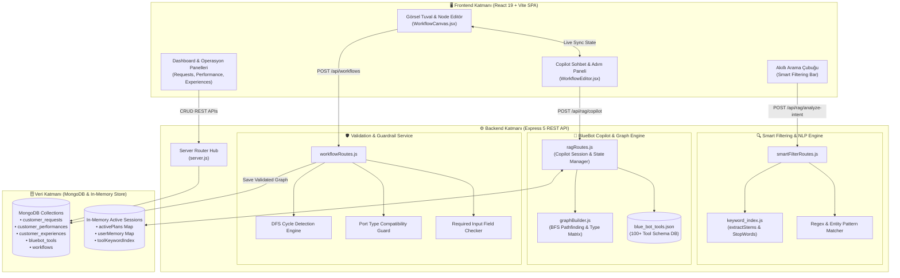
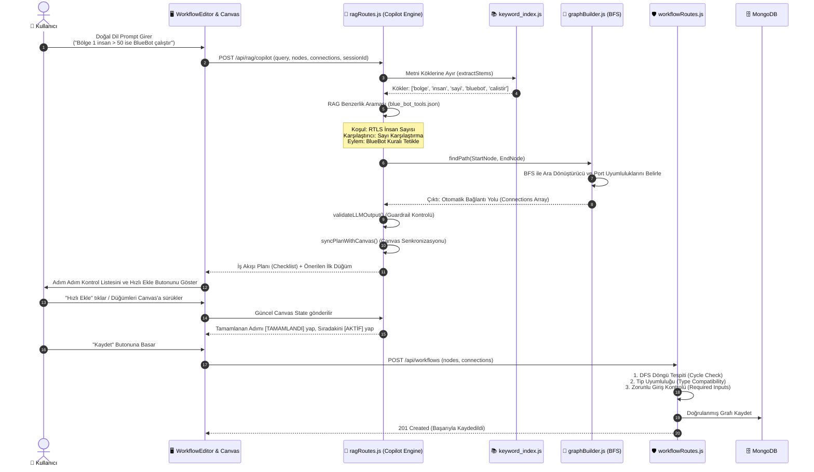
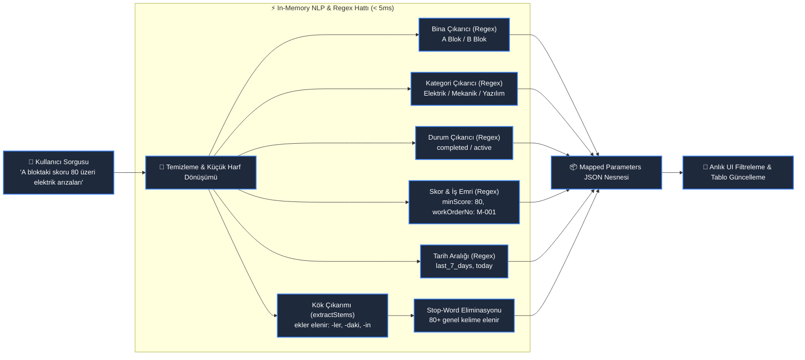
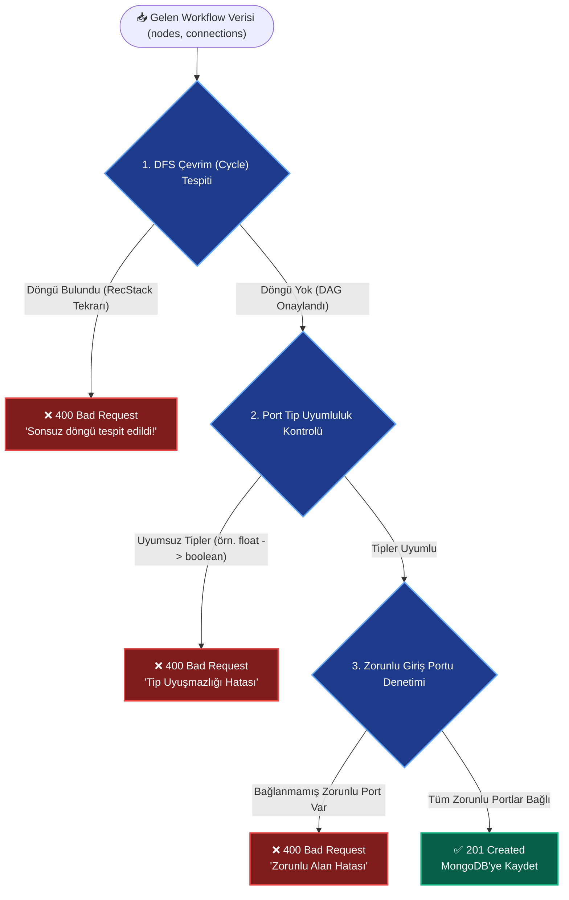
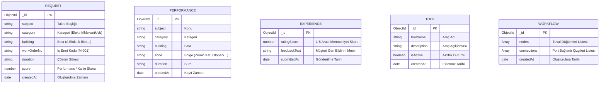

# 🚀 Blue Operation AI Platform & BlueBot Copilot

<div align="center">


<br/>

**Blue Operation AI Platform**, akıllı operasyonel yönetim, gerçek zamanlı analitik, Türkçe doğal dil destekli Akıllı Filtreleme (Smart Filtering) ve doğal dil komutlarından görsel Yönlü Döngüsüz Graf (DAG) iş akışları üreten **BlueBot Copilot** motorunu içeren kapsamlı bir yeni nesil operasyon platformudur.

</div>

---

## 📑 İçindekiler

- [1. Proje Genel Bakışı ve Değer Önerisi](#1-proje-genel-bakışı-ve-değer-önerisi)
- [2. Temel Yetenekler ve Fonksiyonel Modüller](#2-temel-yetenekler-ve-fonksiyonel-modüller)
- [3. Sistem Mimarisi ve Akış Diyagramları](#3-sistem-mimarisi-ve-akış-diyagramları)
  - [3.1 Genel Sistem Mimarisi (End-to-End Architecture)](#31-genel-sistem-mimarisi-end-to-end-architecture)
  - [3.2 BlueBot RAG Copilot & DAG İş Akışı Üretim Hattı](#32-bluebot-rag-copilot--dag-iş-akışı-üretim-hattı)
  - [3.3 Akıllı Filtreleme (Smart Filtering & NLP) Pipeline](#33-akıllı-filtreleme-smart-filtering--nlp-pipeline)
  - [3.4 Graf Doğrulama, Tip Güvenliği ve Döngü Tespiti](#34-graf-doğrulama-tip-güvenliği-ve-döngü-tespiti)
  - [3.5 Veritabanı Varlık-İlişki (ER) Mimarisi](#35-veritabanı-varlık-ilişki-er-mimarisi)
- [4. Teknoloji Yığını (Tech Stack)](#4-teknoloji-yığını-tech-stack)
- [5. Dizin ve Dosya Yapısı](#5-dizin-ve-dosya-yapısı)
- [6. Modül Derinlemesine İnceleme (Module Deep-Dives)](#6-modül-derinlemesine-inceleme-module-deep-dives)
  - [6.1 BlueBot Copilot Motoru & RAG Arama](#61-bluebot-copilot-motoru--rag-arama)
  - [6.2 Türkçe Doğal Dil İşleme & Kök Çıkarıcı](#62-türkçe-doğal-dil-işleme--kök-çıkarıcı)
  - [6.3 Graf Kurucu & BFS Yol Bulucu (GraphBuilder)](#63-graf-kurucu--bfs-yol-bulucu-graphbuilder)
  - [6.4 İnteraktif Canvas & Görsel Workflow Editörü](#64-i̇nteraktif-canvas--görsel-workflow-editörü)
- [7. API Uç Noktaları ve Veri Kontratları](#7-api-uç-noktaları-ve-veri-kontratları)
- [8. Kurulum ve Çalıştırma Rehberi](#8-kurulum-ve-çalıştırma-rehberi)
- [9. Örnek Kullanım Senaryoları ve Doğal Dil Komutları](#9-örnek-kullanım-senaryoları-ve-doğal-dil-komutları)
- [10. Güvenlik, Performans ve Guardrails](#10-güvenlik-performans-ve-guardrails)

---

## 1. Proje Genel Bakışı ve Değer Önerisi

Modern bina ve tesis operasyonlarında; IoT sensörleri, RTLS konum belirleme verileri, kamera alarmları, cihaz arıza bildirimleri ve müşteri talepleri çok yüksek hacimde üretilir. Bu verileri izlemek ve kurallara bağlı otomasyonlar oluşturmak genellikle karmaşık kodlama veya zorlu arayüz formları gerektirir.

**Blue Operation AI Platform**, bu zorlukları iki çığır açıcı yenilikle çözer:

1. **Akıllı Filtreleme (Smart Filtering & NLP):** Kullanıcının doğal Türkçe ifadelerini (*"A bloktaki tamamlanmış skoru 80 üzeri elektrik arızaları"*) in-memory Regex + Stemmer mimarisiyle 1-5 milisaniyede yapısal süzgeçlere dönüştürür.
2. **BlueBot Copilot (RAG & DAG Engine):** Kullanıcının serbest metin otomasyon taleplerini (*"Bölge 1'deki insan sayısı 50'yi geçerse ve mesai saatlerindeyse klima modunu aç ve BlueBot kuralı tetikle"*) analiz eder, 100'den fazla araçlık kütüphaneden uygun düğümleri seçer, BFS ile ara dönüştürücüleri tespit eder, tip uyumluluğunu doğrular ve canlı etkileşimli Canvas üzerinde adım adım iş akışları inşa eder.

```
┌────────────────────────────────────────────────────────────────────────┐
│                        BLUE OPERATION PLATFORM                         │
├────────────────────────┬───────────────────────┬───────────────────────┤
│    Operasyon Merkezi   │   Akıllı Filtreleme   │    BlueBot Copilot    │
│  Talepler & Performans │     NLP Süzgeçleri    │  RAG & DAG Otomasyon  │
└────────────────────────┴───────────────────────┴───────────────────────┘
```

---

## 2. Temel Yetenekler ve Fonksiyonel Modüller

### 🤖 1. BlueBot Copilot & DAG Üretim Motoru
- **Doğal Dilden İş Akışı Tasarımı:** Kullanıcı hedefini kavrar, koşul, operatör, karşılaştırıcı ve eylem düğümlerini mantıksal bir sıraya dizer.
- **RAG Tabanlı Araç Eşleme:** 100+ endüstriyel düğüm arasında Jaccard benzerliği ve kök frekansı ile en doğru araçları bulur.
- **Canlı Canvas Senkronizasyonu:** Kullanıcının tuval üzerindeki düğüm ekleme, silme ve bağlantı adımlarını anlık izleyip kontrol listesini dinamik olarak `[TAMAMLANDI]`, `[AKTİF]`, `[BEKLİYOR]` durumlarına günceller.
- **Deduplication & Sonsuz Döngü Koruması:** Kullanıcının takıldığı adımları tespit eden akıllı guardrail mekanizmaları.

### ⚡ 2. Türkçe Akıllı Filtreleme (Smart Filtering)
- **Alt 5ms Yanıt Süresi:** Dış LLM bağımlılığı olmadan, yerel bellek içi (in-memory) çalışan Türkçe morfolojik analiz motoru.
- **Gelişmiş Varlık Çıkarımı (Entity Extraction):** Bina (A Blok, B Blok), Kategori (Elektrik, Mekanik, Yazılım), Durum (Tamamlanan, Aktif), Skor Eşikleri (`skor > 85`), İş Emri Kodları (`M-001`, `E-002`) ve Tarih aralıklarını otomatik ayrıştırır.
- **80+ Stop-Word & Stemming Süzgeci:** Anlamsız dolgu sözcüklerini temizleyerek doğrudan arama hedefine odaklar.

### 🎨 3. İnteraktif İş Akışı Tuvali (Visual Workflow Canvas)
- **Sürükle & Bırak Düğüm Kütüphanesi:** Portal Nesneleri, Operatörler, Eylemler ve Genel kategorilerinde kategorize edilmiş zengin araç kütüphanesi.
- **Dinamik Bezier Bağlantı Çizgileri:** Çıkış ve giriş portları arasında kusursuz vektörel eğriler.
- **Pan & Zoom & Mini Harita:** Büyük ölçekli otomasyon grafikleri için akıcı gezinme.
- **Canlı Parametre Formları:** Her düğümün parametrelerini tuval üzerinde anında düzenleyebilme.

### 🛡️ 4. Graf Doğrulama & Tip Güvenliği (Guardrails)
- **DFS Döngü Tespiti (Cycle Detection):** Sonsuz döngüye girebilecek hatalı akışları veritabanına kaydedilmeden önce engeller.
- **Tip Uyumluluk Matrisi:** Sayısal (`float`, `integer`, `people_count`), Metinsel (`device_uuid`, `string`), Dizi (`array`) ve Mantıksal (`boolean`) tiplerin birbirine güvenli bağlanmasını temin eder.
- **Unsafe-Any Güvenlik Kilidi:** Ham veya tehlikeli `any` tiplerinin doğrudan `boolean` tetikleyicilere bağlanmasını engeller, araya karşılaştırıcı düğüm koymayı zorunlu kılar.
- **Zorunlu Port Denetimi:** Gerekli girişleri bağlanmamış düğümlerin kaydedilmesini önler.

---

## 3. Sistem Mimarisi ve Akış Diyagramları

### 3.1 Genel Sistem Mimarisi (End-to-End Architecture)

Aşağıdaki mimari diyagramı; React tabanlı kullanıcı arayüzü, Express.js API katmanı, yerleşik RAG/NLP motorları ve MongoDB veritabanı arasındaki veri ve kontrol akışını göstermektedir:



---

### 3.2 BlueBot RAG Copilot & DAG İş Akışı Üretim Hattı

Kullanıcının doğal dil prompt'u girmesinden tuvalde doğrulanmış bir DAG iş akışına dönüşmesine kadar geçen aşamalar:



---

### 3.3 Akıllı Filtreleme (Smart Filtering & NLP) Pipeline

Kullanıcının tek satırlık doğal dildeki arama sorgusunun veritabanı filtre parametrelerine dönüşüm mimarisi:



---

### 3.4 Graf Doğrulama, Tip Güvenliği ve Döngü Tespiti

Bir iş akışı kaydedilmeden önce sunucuda uygulanan 3 aşamalı sıkı güvenlik denetimi:



---

### 3.5 Veritabanı Varlık-İlişki (ER) Mimarisi

Sistemde kullanılan Mongoose modelleri ve koleksiyon ilişkileri:



---

## 4. Teknoloji Yığını (Tech Stack)

| Katman | Teknoloji | Versiyon / Açıklama |
|---|---|---|
| **Frontend Framework** | [React](https://react.dev/) | `^19.0.0` (Modern Hook & Component Mimarisi) |
| **Frontend Build Tool** | [Vite](https://vitejs.dev/) | `^5.0.0` (Ultra hızlı HMR ve Bundle) |
| **Frontend Styling** | [CSS3 & Glassmorphism](https://developer.mozilla.org/) | Özel tasarlanmış koyu tema, değişken tabanlı renk paleti |
| **Backend Runtime** | [Node.js](https://nodejs.org/) | `v18.0.0+` (ES Modules standardı) |
| **Backend Framework** | [Express](https://expressjs.com/) | `^5.2.1` (REST API Katmanı) |
| **Veritabanı & ODM** | [MongoDB](https://www.mongodb.com/) / [Mongoose](https://mongoosejs.com/) | `^9.7.3` (Doküman Veritabanı ve Şema Yönetimi) |
| **Eşzamanlı Çalıştırıcı**| [Concurrently](https://github.com/open-cli-tools/concurrently) | `^10.0.3` (Frontend ve Backend'i tek komutla koşturma) |
| **NLP & Algoritmalar** | Kural Tabanlı Yerleşik Motor | In-Memory RAG, BFS Pathfinding, DFS Cycle Detection, Stemming |

---

## 5. Dizin ve Dosya Yapısı

```bash
blue_bot_copilot/
├── 📁 models/                     # Mongoose Veritabanı Şemaları
│   ├── Experience.js              # Müşteri memnuniyet skoru ve geri bildirim modeli
│   ├── Performance.js             # Operasyonel performans kayıtları modeli
│   ├── Request.js                 # Müşteri iş emri ve talep kayıtları modeli
│   ├── Tool.js                    # BlueBot araç/komponent tanım modeli
│   └── Workflow.js                # Kaydedilmiş DAG iş akışları modeli
│
├── 📁 routes/                     # Express API Uç Noktaları ve AI Motorları
│   ├── experienceRoutes.js        # /api/experiences CRUD işlemleri
│   ├── graphBuilder.js            # BFS yol bulucu, tip matrisi, unsafe-any kilidi
│   ├── keyword_index.js           # Türkçe ek ayıklayıcı (stemmer) & stop-words
│   ├── performanceRoutes.js       # /api/performances CRUD işlemleri
│   ├── ragRoutes.js               # BlueBot Copilot, RAG arama & Canvas senkronizasyonu
│   ├── requestRoutes.js           # /api/requests CRUD işlemleri
│   ├── smartFilterRoutes.js       # Türkçe Akıllı Filtreleme & NLP analiz ucu
│   ├── toolRoutes.js              # /api/tools kayıt ve listeleme
│   └── workflowRoutes.js          # DFS döngü tespiti, tip ve zorunlu alan doğrulayıcı
│
├── 📁 ui_frontend/                # React + Vite Kullanıcı Arayüzü
│   ├── 📁 public/                 # Statik Varlıklar
│   ├── 📁 src/                    # Kaynak Kodlar
│   │   ├── 📁 components/         # React Görünüm ve Arayüz Bileşenleri
│   │   │   ├── BlueBotView.jsx    # Kayıtlı kuralların listesi ve editör geçiş ekranı
│   │   │   ├── DashboardView.jsx  # Genel özet ve müşteri paneli
│   │   │   ├── NodeLibrarySidebar.jsx # Sol araç kütüphanesi (Sürükle-Bırak)
│   │   │   ├── PerformanceView.jsx# Performans analitikleri ve akıllı arama
│   │   │   ├── ReportView.jsx     # Operasyonel raporlar ve metrikler
│   │   │   ├── RequestsView.jsx   # Talepler / İş emirleri tablosu ve NLP arama
│   │   │   ├── Sidebar.jsx        # Ana navigasyon menüsü
│   │   │   ├── Topbar.jsx         # Üst durum ve profil çubuğu
│   │   │   ├── WorkflowCanvas.jsx # İnteraktif SVG/DOM graf tuvali (Pan/Zoom/Nodes)
│   │   │   └── WorkflowEditor.jsx # Copilot sohbet arayüzü ve ana editör konteyneri
│   │   ├── 📁 data/
│   │   │   └── toolsData.js       # Tuvalde kullanılan araçların detaylı frontend kataloğu
│   │   ├── App.jsx                # Ana yönlendirme ve layout yöneticisi
│   │   ├── index.css              # Kapsamlı modern CSS tasarım sistemi
│   │   └── main.jsx               # React başlangıç noktası
│   ├── index.html                 # HTML şablonu
│   ├── package.json               # Frontend bağımlılıkları
│   └── vite.config.js             # Vite yapılandırması
│
├── blue_bot_tools.json            # 100+ Aracın giriş/çıkış/parametre JSON şeması
├── blue_bot_tool_list.md          # Araç kataloğu referans dokümantasyonu
├── package.json                   # Kök bağımlılıklar ve orkestrasyon scriptleri
├── server.js                      # Express sunucu giriş noktası ve middleware montajı
├── README.md                      # Ana Proje Dokümantasyonu (Bu Dosya)
├── README_AKILLI_FILTRELEME.md    # Akıllı Filtreleme detay dokümanı
└── README_BLUEBOT_COPILOT.md      # Copilot & RAG motoru detay dokümanı
```

---

## 6. Modül Derinlemesine İnceleme (Module Deep-Dives)

### 6.1 BlueBot Copilot Motoru & RAG Arama
- **Dosya:** [`routes/ragRoutes.js`](./routes/ragRoutes.js)
- **Oturum Yönetimi:** `activePlans`, `userMemory` ve `searchMemory` in-memory `Map` yapıları ile her kullanıcının oturum bağlamını kaybetmeden saklar.
- **RAG Eşleme Algoritması:** Kullanıcı metnini `extractStems` ile parçalar, `blue_bot_tools.json` içindeki araç açıklamaları, etiketleri ve parametreleri ile Jaccard benzerliği üzerinden puanlar.
- **Sync Engine (`syncPlanWithCanvas`):** Tuvaldeki mevcut düğümleri (`canvasNodes`) ve bağlantıları (`canvasConnections`) plandaki adımlarla eşleştirir. Düğüm eklendiğinde veya parametresi girildiğinde adımı otomatik tamamlar.

### 6.2 Türkçe Doğal Dil İşleme & Kök Çıkarıcı
- **Dosyalar:** [`routes/smartFilterRoutes.js`](./routes/smartFilterRoutes.js) & [`routes/keyword_index.js`](./routes/keyword_index.js)
- **Kök Çıkarımı (`extractStems`):** Türkçe çekim ve yapım eklerini (`-leri`, `-ları`, `-deki`, `-daki`, `-den`, `-dan`, `-in`, `-un`, `-si`, `-su`) düzenli ifadelerle soyar.
- **Stop-Word Temizliği:** 80'den fazla genel dolgu sözcüğünü (`bina`, `blok`, `arıza`, `rapor`, `getir`, `listele`, `ve`, `ile`, `olan`) filtreleyerek sadece anahtar terimleri çıkarır.
- **Performans:** Analiz ortalama **1.8 ms** sürmektedir.

### 6.3 Graf Kurucu & BFS Yol Bulucu (GraphBuilder)
- **Dosya:** [`routes/graphBuilder.js`](./routes/graphBuilder.js)
- **Genişlik Öncelikli Arama (BFS):** Başlangıç sensörü ile hedef eylemi arasında doğrudan bağlantı kurulamıyorsa, aradaki dönüştürücü/karşılaştırıcı ara düğümleri (`middleTools`) BFS kuyruğu ile otomatik keşfeder ve en kısa yolu bağlantı listesi olarak üretir.
- **Tip Uyumluluk Matrisi (`areTypesCompatible`):**
  - Sayısal küme: `float`, `integer`, `number`, `people_count`, `epoch_integer`
  - Metinsel küme: `string`, `device_uuid`, `building_id`, `datetime_string`, `datetime_object`, `workorder_enum`
  - Dizi kümesi: `string_array`, `device_uuid_array`, `array`
  - Evrensel tip: `any`

### 6.4 İnteraktif Canvas & Görsel Workflow Editörü
- **Dosyalar:** [`ui_frontend/src/components/WorkflowCanvas.jsx`](./ui_frontend/src/components/WorkflowCanvas.jsx) & [`ui_frontend/src/components/WorkflowEditor.jsx`](./ui_frontend/src/components/WorkflowEditor.jsx)
- **SVG Bezier Bağlantıları:** Düğüm çıkış portu $(x_1, y_1)$ ile giriş portu $(x_2, y_2)$ arasında dinamik $C(x_1 + dx, y_1, x_2 - dx, y_2, x_2, y_2)$ kübik Bezier eğrileri çizer.
- **Reaktif State Yönetimi:** Canvas üzerindeki her değişiklik Copilot paneline canlı yansır ve adımların ilerlemesini sağlar.

---

## 7. API Uç Noktaları ve Veri Kontratları

### 7.1 BlueBot Copilot Uç Noktası
- **URL:** `POST /api/rag/copilot`
- **İstek Gövdesi:**
```json
{
  "query": "Bölge 1'deki insan sayısı 50'den büyükse BlueBot çalıştır",
  "nodes": [],
  "connections": [],
  "session_id": "session_default"
}
```
- **Başarılı Yanıt:**
```json
{
  "intent": "workflow_creation",
  "message": "### İş Akışı İlerleme Planı (0/4 Adım Tamamlandı)\n\n1. **[AKTİF]** 'RTLS Bölge İnsan Sayısı' aracını ekleyin...\n",
  "is_workflow_complete": false,
  "is_full_checklist": true,
  "suggested_tool": {
    "id": "rtls_zone_people_count",
    "name": "RTLS Bölge İnsan Sayısı",
    "category": "Koşul"
  }
}
```

---

### 7.2 Akıllı Filtreleme Uç Noktası
- **URL:** `POST /api/rag/analyze-intent`
- **İstek Gövdesi:**
```json
{
  "text": "A bloktaki skoru 80 üzeri tamamlanmış elektrik talepleri"
}
```
- **Başarılı Yanıt:**
```json
{
  "intent": "Performans Analizi",
  "latency_ms": 2,
  "mapped_parameters": {
    "building": "A Blok",
    "status": "completed",
    "category": "Elektrik",
    "minScore": 80,
    "workOrderNo": "all",
    "date_range": "all",
    "zone": "all",
    "action": "all",
    "keywords": ["elektrik"]
  }
}
```

---

### 7.3 İş Akışı Kaydetme ve Doğrulama
- **URL:** `POST /api/workflows`
- **İstek Gövdesi:**
```json
{
  "nodes": [
    { "id": "node-1", "name": "RTLS Bölge İnsan Sayısı", "x": 100, "y": 150 },
    { "id": "node-2", "name": "Sayı Karşılaştırma", "x": 400, "y": 150 },
    { "id": "node-3", "name": "BlueBot Kuralı Tetikle", "x": 700, "y": 150 }
  ],
  "connections": [
    { "fromId": "node-1", "fromPort": 0, "toId": "node-2", "toPort": 0 },
    { "fromId": "node-2", "fromPort": 0, "toId": "node-3", "toPort": 0 }
  ]
}
```
- **Başarılı Yanıt (201 Created):**
```json
{
  "message": "İş akışı başarıyla doğrulandı ve veritabanına kaydedildi.",
  "data": {
    "_id": "66bc90e...",
    "nodes": [...],
    "connections": [...],
    "createdAt": "2026-08-15T12:00:00.000Z"
  }
}
```

---

## 8. Kurulum ve Çalıştırma Rehberi

### 8.1 Ön Gereksinimler
- [Node.js](https://nodejs.org/) (Sürüm 18 veya üzeri önerilir)
- [MongoDB](https://www.mongodb.com/) (Yerel kurulum veya MongoDB Atlas bulut bağlantısı)

---

### 8.2 Hızlı Kurulum (Tüm Bağımlılıklar)

Proje kök dizininde tüm bağımlılıkları tek seferde kurmak için:

```bash
# Kök ve Frontend bağımlılıklarını eşzamanlı yükler
npm run install-all
```

---

### 8.3 Ortam Değişkenleri (.env)

Kök dizinde `.env` dosyasını yapılandırın:

```env
PORT=5000
MONGO_URI=mongodb://127.0.0.1:27017/blue_operation
```

---

### 8.4 Geliştirme Ortamını Başlatma (Full-Stack)

Frontend ve Backend sunucularını aynı anda tek bir komutla ayağa kaldırmak için:

```bash
npm run dev
# veya
npm start
```

Bu komut `concurrently` kullanarak:
- **Backend API:** `http://localhost:5000`
- **Frontend SPA (Vite):** `http://localhost:5173` üzerinde çalıştırır.

---

### 8.5 Ayrı Ayrı Çalıştırma (Opsiyonel)

Sadece Backend'i başlatmak için:
```bash
npm run server
```

Sadece Frontend'i başlatmak için:
```bash
npm run client
```

Üretim (Production) derlemesi almak için:
```bash
npm run build-client
```

---

## 9. Örnek Kullanım Senaryoları ve Doğal Dil Komutları

### Senaryo 1: RTLS Tabanlı Yoğunluk & Konfor Otomasyonu
> **Kullanıcı Prompt'u:** *"Bölge 1'deki insan sayısı 50'den büyükse BlueBot kuralı tetikle"*
- **Oluşturulan Graf:**
  1. `RTLS Bölge İnsan Sayısı` (Sensör Çıktısı: `people_count`)
  2. `Sayı Karşılaştırma` (Giriş: `number`, Parametre: `> 50`, Çıkış: `boolean`)
  3. `BlueBot Kuralı Tetikle` (Tetikleyici Giriş: `boolean`)

### Senaryo 2: Kritik Donanım Alarmı ve Bildirim
> **Kullanıcı Prompt'u:** *"A Bloktaki yangın sensörü alarm verirse acil durum SMS'i ve e-posta gönder"*
- **Oluşturulan Graf:**
  1. `Sensör Alarm Durumu` (Bina: A Blok)
  2. `Mantık Kapısı (AND/Branch)`
  3. `SMS Gönder` & `E-Posta Gönder`

### Senaryo 3: Doğal Dil ile Akıllı Talep Süzme
- Arama Çubuğuna: `"A bloktaki tamamlanan mekanik arızaları getir"`
- **Sonuç:** Bina = `A Blok`, Durum = `completed`, Kategori = `Mekanik` parametreleri süzgeçlere otomatik yansır ve eşleşen kayıtlar listelenir.

---

## 10. Güvenlik, Performans ve Guardrails

- **Sıfır Dış LLM Maliyeti & Gecikmesi:** Akıllı filtreleme ve RAG eşlemeleri bellek içi (in-memory) çalıştığı için 1-5ms içinde yanıt döner.
- **Anti-Hallucination Guardrail (`validateLLMOutput`):** Üretilen tüm düğüm ve port isimleri `blue_bot_tools.json` veritabanı ile birebir doğrulanır.
- **Tip ve Güvenlik Kilidi (`isUnsafeAnyToBoolean`):** `type_safety: 'warning'` taşıyan ham `any` verilerin doğrudan tetikleyicilere bağlanması engellenir.
- **DAG Bütünlüğü:** `dfs()` döngü tespit motoru sayesinde çevrimsel (sonsuz döngü oluşturan) akışların çalışması önlenir.

---

<div align="center">

Geliştirici Ekip: **Blue Operation AI Team**  
Lisans: **ISC License** • 2026

</div>
